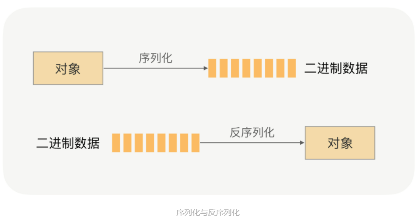

# 协议和序列化

## 1. 协议的作用

+ RPC需要将对象序列化为二进制数据，写入本地 Socket 中，然后被网卡发送到网络设备中进行网络传输，但是在传输过程中，RPC 并不会把请求参数的所有二进制数据整体一下子发送到对端机器上，中间可能会拆分成好几个数据包，也可能会合并其他请求的数据包（同一个 TCP 连接上的数据），至于怎么拆分合并，这其中的细节会涉及到系统参数配置和 TCP 窗口大小。
+ 对于服务提供方来说，他会从 TCP 通道里面收到很多的二进制数据，那这时候怎么识别出哪些二进制是第一个请求的呢？
+ 所以我们需要对 RPC 传输数据的时候进行“断句”，在应用发送请求的数据包里面加入“句号”，这样接收方应用数据流里面分割出正确的数据，“句号”就相当于是消息的边界，用于标识请求数据的结束位置。于是需要在发送请求的时候定一个边界，在请求收到的时候按照这个设定的边界进行数据分割，避免语义不一致的事情发生，而这个边界语义的表达，就是所谓的协议。

## 2. 协议的设计

+ 为什么不直接使用现有的 HTTP 协议呢？
  + 相对于 HTTP 的用处，RPC 给更多的是负责应用间的通信，所以性能要求更高。但是 HTTP 协议的数据包大小相对于请求数据本身要大很多，有需要加入很多无用的内容，比如换行符号、回车符等；
  + 还有一个重要的原因就是 HTTP 协议属于无状态协议，客户端无法对请求和响应进行关联，每次请求都需要重新建立连接，响应完之后再关闭连接。所以对于要求高性能的 RPC 来说，HTTP 协议很难满足需求，RPC 会选择 **设计更紧凑的私有协议** 。

+ 私有通信协议设计同一协议通信。

    ```C++
    +--------+--------+--------+--------+--------+--------+--------+--------+--------+--------+--------+--------+--------+--------+--------+--------+--------+--------+--------+--------+
    |  BYTE  |        |        |        |        |        |        |        |        |        |        |             ........                                                           |
    +--------+--------+--------+--------+--------+--------+--------+--------+--------+--------+--------+--------+--------+--------+--------+--------+--------+--------+--------+--------+
    |  magic | version|  type  |          sequence id              |          content length           |             content byte[]                                                     |
    +--------+--------+--------+--------+--------+--------+--------+--------+--------+--------+--------+--------+--------+--------+--------+--------+--------+--------+--------+--------+
    ```

  + 协议如下：
    + **magic**: 协议魔法数字
    + **version**: 协议版本号，以便对协议进行扩展，使用不同的协议解析器。
    + **type**: 消息请求类型
    + **sequence id**: 一个32位序列号，用来识别请求顺序。
    + **content length**: 消息长度，即后面要接收的内容长度。
    + **content byte**: 消息具体内容

## 3. 具体实现

+ 协议魔法数字（magic）
  + 魔数是通信双方协商的一个暗号，一个字节
  + 魔数的作用是用于服务端在接受数据时先解析出魔数做正确性对比，如果和协议中的魔数不匹配，则认为是非法数据，可以直接关闭连接或采取其他措施增强系统安全性。
  + 魔数只是一个简单的校验，如果有安全性方面的需求，需要使用其他手段，比如SSL/TLS。

  ```C++
  static constexpr uint8_t MAGIC = 0xcc;
  ```

+ 协议版本号
  + 为了应对业务需求的变化，可能需要对自定义协议的结构或字段进行改动。不同版本的协议对应的解析方法也是不同的。所以在生产级项目中强烈建议预留协议版本这个字段。

  ```C++
  static constexpr uint8_t DEFAULT_VERSION = 0x01;
  ```

+ 消息类型定义

    ```C++
    enum class MsgType : uint8_t
    {
    HEARTBEAT_PACKET, // 心跳包
    RPC_PROVIDER,     // 向服务中心声明为provider
    RPC_CONSUMER,     // 向服务中心声明为consumer

    RPC_REQUEST,      // 通用请求
    RPC_RESPONSE,     // 通用响应

    RPC_METHOD_REQUEST,  // 请求方法调用
    RPC_METHOD_RESPONSE, // 响应方法调用

    RPC_SERVICE_REGISTER, // 向中心注册服务
    RPC_SERVICE_REGISTER_RESPONSE,

    RPC_SERVICE_DISCOVER, // 向中心请求服务发现
    RPC_SERVICE_DISCOVER_RESPONSE,

    RPC_SUBSCRIBE_REQUEST, // 订阅
    RPC_SUBSCRIBE_RESPONSE,

    RPC_PUBLISH_REQUEST,   // 发布
    RPC_PUBLISH_RESPONSE
    };
    ```

+ 序列号 sequence id

  + 每个请求分配好请求 id ，这样响应数据的时候，才能对的上。

+ 消息长度
  
  ```C++
  static constexpr uint8_t BASE_LENGTH = 11;
  ```

+ 消息内容

  + 存放具体的数据，包括请求的参数、响应的结果等。

+ 协议类实现

    ```C++
    class Protocol
    {
    public:
        using ptr = std::shared_ptr<Protocol>;

        static constexpr uint8_t MAGIC = 0xcc;
        static constexpr uint8_t DEFAULT_VERSION = 0x01;
        static constexpr uint8_t BASE_LENGTH = 11;

        enum class MsgType : uint8_t
        {
            HEARTBEAT_PACKET, // 心跳包
            RPC_PROVIDER,     // 向服务中心声明为provider
            RPC_CONSUMER,     // 向服务中心声明为consumer

            RPC_REQUEST,  // 通用请求
            RPC_RESPONSE, // 通用响应

            RPC_METHOD_REQUEST,  // 请求方法调用
            RPC_METHOD_RESPONSE, // 响应方法调用

            RPC_SERVICE_REGISTER, // 向中心注册服务
            RPC_SERVICE_REGISTER_RESPONSE,

            RPC_SERVICE_DISCOVER, // 向中心请求服务发现
            RPC_SERVICE_DISCOVER_RESPONSE,

            RPC_SUBSCRIBE_REQUEST, // 订阅
            RPC_SUBSCRIBE_RESPONSE,

            RPC_PUBLISH_REQUEST, // 发布
            RPC_PUBLISH_RESPONSE
        };

        static Protocol::ptr Create(MsgType type, const std::string &content, uint32_t id);
        static Protocol::ptr HeartBeat();

        ByteArray::ptr encodeMeta();
        ByteArray::ptr encode();

        void decodeMeta(ByteArray::ptr bt);
        void decode(ByteArray::ptr bt);

        std::string toString();

    private:
        uint8_t m_magic = MAGIC;
        uint    ByteArray::ptr Protocol::encode()
    {
        ByteArray::ptr bt = std::make_shared<ByteArray>();
        bt->writeFuint8(m_magic);
        bt->writeFuint8(m_version);
        bt->writeFuint8(m_type);
        bt->writeFuint32(m_sequence_id);
        bt->writeStringF32(m_content);
        bt->setPosition(0);
        return bt;
    }

    void Protocol::decode(ByteArray::ptr bt)
    {
        m_magic = bt->readFuint8();
        m_version = bt->readFuint8();
        m_type = bt->readFuint8();
        m_sequence_id = bt->readFuint32();
        m_content = bt->readStringF32();
        m_content_length = m_content.size();
    }8_t m_version = DEFAULT_VERSION;
        uint8_t m_type = 0;
        uint32_t m_sequence_id = 0;
        uint32_t m_content_length = 0;
        std::string m_content;
    };

    Protocol::ptr Protocol::Create(MsgType type, const std::string &content, uint32_t id = 0)
    {
        Protocol::ptr proto = std::make_shared<Protocol>();
        proto->setMsgType(type);
        proto->setContent(content);
        proto->setSequenceId(id);
        return proto;
    }

    Protocol::ptr Protocol::HeartBeat()
    {
        static Protocol::ptr Heartbeat = Protocol::Create(Protocol::MsgType::HEARTBEAT_PACKET, "");
        return Heartbeat;
    }

    ByteArray::ptr Protocol::encode()
    {
        ByteArray::ptr bt = std::make_shared<ByteArray>();
        bt->writeFuint8(m_magic);
        bt->writeFuint8(m_version);
        bt->writeFuint8(m_type);
        bt->writeFuint32(m_sequence_id);
        bt->writeStringF32(m_content);
        bt->setPosition(0);
        return bt;
    }

    void Protocol::decode(ByteArray::ptr bt)
    {
        m_magic = bt->readFuint8();
        m_version = bt->readFuint8();
        m_type = bt->readFuint8();
        m_sequence_id = bt->readFuint32();
        m_content = bt->readStringF32();
        m_content_length = m_content.size();
    }
    ```

## 4. 序列化

### 4.1 为什么需要序列化？

+ 网络传输的数据必须是二进制数据，但调用方请求的出入参数都是对象。对象是不能直接在网络中传输，我们需要提前把它转成可传输的二进制，并要求转换算法是可逆的，这个过程我们一般叫做“序列化”。服务提供方就可以正确的从二进制数据中分割出不同的请求，同时根据请求类型和序列化类型，把二进制消息逆向还原成请求对象，称之为”反序列化“。



+ 序列化的实现
  + 序列化模块支持了基本类型和标准库容器的序列化，包括：
    + 顺序容器：string、list、vector
    + 关联容器：set、multiset、map、multimap
    + 无序容器：unordered_set、unordered_multiset、unordered_map、unordered_multimap
    + 异构容器：tuple
    + 以及以上任意组合嵌套类型的序列化
  + 对于任意用户自定义类型，只要实现了以下的重载，即可参与传输时的序列化。

    ```C++
    template<typename T>
    Serializer &operator >> (Serializer& in, T& i)
    {
        return *this;
    }
    template<typename T>
    Serializer &operator << (Serializer& in, T i)
    {
        return *this;
    }
    ```

+ 序列化有如下规则：
  + 默认情况下序列化，8，16位类型以及浮点数不压缩，32，64位有符号/无符号数采用 zigzag 和 varints 编码压缩
  + 针对 std::string 会将长度信息压缩序列化作为元数据，然后将原数据直接写入。char数组会先转换成 std::string 后按此规则序列化
  + 调用 writeFint 将不会压缩数字，调用 writeRowData 不会加入长度信息

+ rpc调用过程：
  + 调用方发起过程调用时，自动将参数打包成tuple，然后序列化传输。
  + 被调用方收到调用请求时，先将参数包反序列回tuple，再解包转发给函数。

```C++
class Serializer
    {
    public:
        using ptr = std::shared_ptr<Serializer>;

        Serializer() { m_byteArray = std::make_shared<ByteArray>(); }

        Serializer(ByteArray::ptr byteArray) { m_byteArray = byteArray; }

        Serializer(const std::string &in)
        {
            m_byteArray = std::make_shared<ByteArray>();
            writeRowData(&in[0], in.size());
            reset();
        }

        Serializer(const char *in, int len)
        {
            m_byteArray = std::make_shared<ByteArray>();
            writeRowData(in, len);
            reset();
        }

    public:

        // 写入原始数据
        void writeRowData(const char *in, int len) { m_byteArray->write(in, len); }

        // 写入无压缩数字
        template <class T>
        void writeFint(T value)
        {
            m_byteArray->writeFint(value);
        }

        template <typename T>
        void read(T &t)
        {
            if constexpr (std::is_same_v<T, bool>)
            {
                t = m_byteArray->readFint8();
            }
            else if constexpr (std::is_same_v<T, float>)
            {
                t = m_byteArray->readFloat();
            }
            else if constexpr (std::is_same_v<T, int8_t>)
            {
                t = m_byteArray->readFint8();
            }

            .............................................
            .............................................

            else if constexpr (std::is_same_v<T, std::string>)
            {
                t = m_byteArray->readStringVint();
            }
        }

        template <typename T>
        void write(T t)
        {
            if constexpr (std::is_same_v<T, bool>)
            {
                m_byteArray->writeFint8(t);
            }
            else if constexpr (std::is_same_v<T, float>)
            {
                m_byteArray->writeFloat(t);
            }

            .............................................
            .............................................
            
            else if constexpr (std::is_same_v<T, std::string>)
            {
                m_byteArray->writeStringVint(t);
            }
        }

    public:
        template <typename... Args>
        Serializer &operator>>(std::tuple<Args...> &t)
        {
            // 实际的反序列化函数，利用折叠表达式展开参数包
            const auto &deserializer = [this]<typename Tuple, std::size_t... Index>(Tuple &t, std::index_sequence<Index...>)
            {
                (void)((*this) >> ... >> std::get<Index>(t));
            };
            deserializer(t, std::index_sequence_for<Args...>{});
            return *this;
        }

        template <typename... Args>
        Serializer &operator<<(const std::tuple<Args...> &t)
        {
            // 实际的序列化函数，利用折叠表达式展开参数包
            const auto &package = [this]<typename Tuple, std::size_t... Index>(const Tuple &t, std::index_sequence<Index...>)
            {
                (void)((*this) << ... << std::get<Index>(t));
            };
            package(t, std::index_sequence_for<Args...>{});
            return *this;
        }

        // 支持标准模板库的序列化，以std::vector为例
        template <typename T>
        Serializer &operator>>(std::vector<T> &v)
        {
            size_t size;
            read(size);
            for (size_t i = 0; i < size; ++i)
            {
                T t;
                read(t);
                v.template emplace_back(t);
            }
            return *this;
        }

        template <typename T>
        Serializer &operator<<(const std::vector<T> &v)
        {
            write(v.size());
            for (auto &t : v)
            {
                (*this) << t;
            }
            return *this;
        }

    private:
        dbspider::ByteArray::ptr m_byteArray;
    };
```