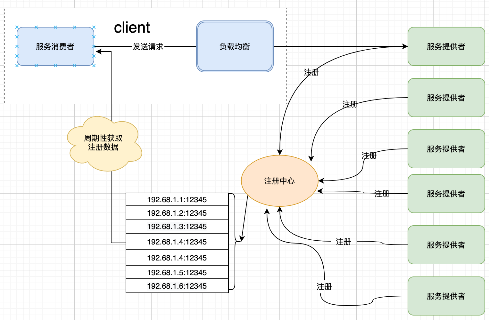

# 服务注册中心



## 1. 服务注册中心 `RpcServiceRegistry` 概述

+ 继承自 **`TcpServer`** 。
+ 处理服务端的**服务注册**请求 ----> `handleRegisterService()`
+ 处理客户端的**服务发现**请求 ----> `handleDiscoverService()`
+ **服务上线**与**服务下线**通知发布
+ 处理客户端**订阅**请求 ----> `handleSubscribe()` 。
+ 采用心跳进行**健康检查**：
  + 接收并处理服务端和客户端的心跳包，调用 `handleHeartbeatPacket()` 方法。

## 2. 服务注册中心流程

+ (1) 创建 **RpcServiceRegistry** 对象；
+ (2) `bind()` 绑定本地地址；
+ (3) 支持 `publish()` 消息；
+ (3) 调用 `start()`方法开启 `RpcServiceRegistry` 服务注册中心；
  + 开启协程定时清理订阅列表；
  + 开启对RPC服务端和RPC客户端的监听并处理请求；
    + 对于RPC服务端
      + 处理与RPC服务端的心跳检测 `handleHeartbeatPacket`
      + 处理RPC服务端的连接 `handleProvider`
      + 处理RPC服务端发来的服务注册请求 `handleRegisterService`
      + 在服务注册时向客户端发布服务上线通知
      + 在RPC服务端断开时向客户端发布服务下线通知
    + 对于RPC客户端
      + 与客户端的心跳检测 `handleHeartbeatPacket`
      + 处理客户端的服务发现 `handleDiscoverService`
      + 处理订阅请求 `handleSubscribe`

## 3. 服务注册中心设计

### 3.1 代码框架

  ```C++
  class RpcServiceRegistry : public TcpServer
    {
    public:
        using ptr = std::shared_ptr<RpcServiceRegistry>;
        using MutexType = CoMutex;
        RpcServiceRegistry(IOManager *worker = IOManager::GetThis(),
                           IOManager *accept_worker = IOManager::GetThis());

        ~RpcServiceRegistry();

        // 发布消息
        template <typename T>
        void publish(const std::string &key, T data);

    protected:
        // 更新心跳定时器
        void update(Timer::ptr &heartTimer, Socket::ptr client);

        // 处理端请求
        void handleClient(Socket::ptr client) override;

        // 为服务端提供服务注册:将服务地址注册到对应服务名下,断开连接后地址自动清除
        Protocol::ptr handleRegisterService(Protocol::ptr p, Address::ptr address);

        // 移除注册服务
        void handleUnregisterService(Address::ptr address);

        // 为客户端提供服务发现
        // 返回值：服务地址列表
        Protocol::ptr handleDiscoverService(Protocol::ptr p);

        // 处理 provider 初次连接时的事件，获取开放服务的端口
        Address::ptr handleProvider(Protocol::ptr p, Socket::ptr sock);

        // 处理心跳包
        Protocol::ptr handleHeartbeatPacket(Protocol::ptr p);

        // 处理订阅请求
        Protocol::ptr handleSubscribe(Protocol::ptr proto, RpcSession::ptr client);

    private:
        std::multimap<std::string, std::string> m_services;                                            // 维护服务名和服务地址列表的多重映射
        std::map<std::string, std::vector<std::multimap<std::string, std::string>::iterator>> m_iters; // 维护服务地址到迭代器的映射
        MutexType m_mutex;
        uint64_t m_AliveTime;                                                         // 允许心跳超时的时间 默认 40s
        std::unordered_multimap<std::string, std::weak_ptr<RpcSession>> m_subscribes; // 订阅的客户端
        MutexType m_sub_mtx;                                                          // 保护 m_subscribes
        bool m_stop_clean = false;                                                    // 停止清理订阅协程
        Channel<bool> m_clean_chan{1};                                                // 等待清理协程停止
    };
  ```

### 3.2 重要成员变量

+ **`m_services`** ：维护服务名和服务地址列表的多重映射， `key` 为服务名， `value` 为服务地址(`IP+Port`)，一个服务下有多个服务地址， 同时需要维护连接状态，断开连接后移除服务。；
+ **`m_iters`** ：维护服务地址到 `m_services` 迭代器的映射；
+ **`m_subscribes`** ： 一个 `map` ，保存订阅的客户端， `key` 为 服务名， `value` 为与客户端的会话。

### 3.3 重要成员方法

#### 3.3.1 `bind()` 方法

+ 继承自 **TcpServer** ,绑定本地地址

#### 3.3.2 `start()` 方法

+ 继承自 **TcpServer**，开启对RPC服务端和RPC客户端的监听，并处理连接事件

#### 3.3.3 `handleClient()` 方法

+ 对于RPC服务端
  + 处理与RPC服务端的心跳检测 -->  `handleHeartbeatPacket()`
  + 处理RPC服务端的连接 -->  `handleProvider()`
  + 处理RPC服务端发来的服务注册请求 -->  `handleRegisterService()`
+ 对于RPC客户端
  + 与客户端的心跳检测 -->  `handleHeartbeatPacket()`
  + 处理客户端的服务发现 -->  `handleDiscoverService()`
  + 处理订阅请求 -->  `handleSubscribe()`

  ```C++
  void RpcServiceRegistry::handleClient(Socket::ptr client)
  {
      DBSPIDER_LOG_DEBUG(g_logger) << "handleClient: " << client->toString();
      RpcSession::ptr session = std::make_shared<RpcSession>(client);
      Timer::ptr heartTimer;
      // 开启心跳定时器
      update(heartTimer, client);
  
      Address::ptr providerAddr;
      while (true)
      {
          Protocol::ptr request = session->recvProtocol();
          if (!request)
          {
              if (providerAddr)
              {
                  DBSPIDER_LOG_WARN(g_logger) << client->toString() << " was closed; unregister " <<   providerAddr->toString();
                  handleUnregisterService(providerAddr);
              }
              return;
          }
          // 更新定时器
          update(heartTimer, client);
  
          Protocol::ptr response;
          Protocol::MsgType type = request->getMsgType();
  
          switch (type)
          {
          case Protocol::MsgType::HEARTBEAT_PACKET:
              response = handleHeartbeatPacket(request);
              break;
          case Protocol::MsgType::RPC_PROVIDER:
              DBSPIDER_LOG_DEBUG(g_logger) << client->toString();
              providerAddr = handleProvider(request, client);
              continue;
          case Protocol::MsgType::RPC_SERVICE_REGISTER:
              response = handleRegisterService(request, providerAddr);
              break;
          case Protocol::MsgType::RPC_SERVICE_DISCOVER:
              response = handleDiscoverService(request);
              break;
          case Protocol::MsgType::RPC_SUBSCRIBE_REQUEST:
              response = handleSubscribe(request, session);
              break;
          case Protocol::MsgType::RPC_PUBLISH_RESPONSE:
              continue;
          default:
              DBSPIDER_LOG_WARN(g_logger) << "protocol:" << request->toString();
              continue;
          }
  
          session->sendProtocol(response);
      }
  }
  ```

#### 3.3.3.1 心跳检测：`handleHeartbeatPacket()` 方法

+ 接收到RPC服务端和RPC客户端的 `HEARTBEAT_PACKET` 心跳包，调用 `handleHeartbeatPacket()` 返回心跳包。

    ```C++
    Protocol::ptr RpcServer::handleHeartbeatPacket(Protocol::ptr p)
    {
        return Protocol::HeartBeat();
    }
    ```

#### 3.3.3.2 服务注册：`handleRegisterService()` 方法

+ 每一个服务提供者对应的机器或者实例在启动运行的时候，都去向注册中心注册自己提供的服务以及开放的端口。注册中心收到服务提供者的注册服务请求后，调用 `handleRegisterService()` 方法将服务提供方的注册服务名、IP地址和端口号保存到 m_services，并发布服务上线消息。

    ```C++
    Protocol::ptr RpcServiceRegistry::handleRegisterService(Protocol::ptr p, Address::ptr address)
    {
        std::string serviceAddress = address->toString();
        std::string serviceName = p->getContent();

        MutexType::Lock lock(m_mutex);
        auto it = m_services.emplace(serviceName, serviceAddress);
        m_iters[serviceAddress].push_back(it);
        lock.unlock();

        Result<std::string> res = Result<std::string>::Success();
        res.setVal(serviceName);

        Serializer s;
        s << res;
        s.reset();

        Protocol::ptr proto =
            Protocol::Create(Protocol::MsgType::RPC_SERVICE_REGISTER_RESPONSE, s.toString());

        // 发布服务上线消息
        std::tuple<bool, std::string> data{true, serviceAddress};
        publish(RPC_SERVICE_SUBSCRIBE + serviceName, data);

        return proto;
    }
    ```

#### 3.3.3.3 服务发现：`handleDiscoverService()` 方法

+ 虽然服务调用是服务消费方直接发向服务提供方的，但是分布式的服务，都是集群部署的，服务的提供者数量也是动态变化的，所以服务的地址也就无法预先确定。 因此服务注册中心提供服务发现的功能。
+ 客户端从注册中心获取服务，它需要在发起调用时，从注册中心拉取开放服务的服务器地址列表存入本地缓存。
+ 服务注册中心收到RPC客户端的 `RPC_SERVICE_DISCOVER` 请求，向客户端发送所有服务节点地址

 ```C++
 Protocol::ptr RpcServiceRegistry::handleDiscoverService(Protocol::ptr p)
 {
     std::string serviceName = p->getContent();
     std::vector<Result<std::string>> result;
     ByteArray byteArray;
 
     MutexType::Lock lock(m_mutex);
     m_services.equal_range(serviceName);
     auto range = m_services.equal_range(serviceName);
     uint32_t cnt = 0;
     // 若服务未注册，返回 RPC_NO_METHOD 消息
     if (range.first == range.second)
     {
         cnt++;
         Result<std::string> res;
         res.setCode(RPC_NO_METHOD);
         res.setMsg("discover service:" + serviceName);
         result.push_back(res);
     }
     // 若服务注册，从 m_services 里获取所有服务节点地址，并返回 RPC_SUCCESS 消息
     else
     {
         for (auto i = range.first; i != range.second; ++i)
         {
             Result<std::string> res;
             std::string addr;
             res.setCode(RPC_SUCCESS);
             res.setVal(i->second);
             result.push_back(res);
         }
         cnt = result.size();
     }
 
     Serializer s;
     s << serviceName << cnt;
     for (uint32_t i = 0; i < cnt; ++i)
     {
         s << result[i];
     }
     s.reset();
     Protocol::ptr proto =
         Protocol::Create(Protocol::MsgType::RPC_SERVICE_DISCOVER_RESPONSE, s.toString());
     return proto;
 }
 ```

#### 3.3.3.4 服务订阅：`handleSubscribe()` 方法

+ 收到 RPC客户端的订阅消息 `RPC_SUBSCRIBE_REQUEST` 请求 ，调用 `handleSubscribe()` 将订阅key和与客户端的会话保存到 `m_subscribes`。

    ```C++
    Protocol::ptr RpcServiceRegistry::handleSubscribe(Protocol::ptr proto, RpcSession::ptr client)
    {
        MutexType::Lock lock(m_sub_mtx);
        std::string key;
        Serializer s(proto->getContent());
        s >> key;
        m_subscribes.emplace(key, std::weak_ptr<RpcSession>(client));
        Result<> res = Result<>::Success();
        s.reset();
        s << res;
        return Protocol::Create(Protocol::MsgType::RPC_SUBSCRIBE_RESPONSE, s.toString(), 0);
    }
    ```

## 4. 发布/订阅模式

### 4.1 发布/订阅模式概述

+ 当一个已有服务提供者节点下线， 或者一个新的服务提供者节点加入时，订阅对应接口的消费者能及时收到注册中心的通知， 并更新本地的服务地址缓存。 这样后续的服务调用就能避免调用已经下线的节点， 并且能调用到新的服务节点。
+ 发布/订阅模式就是解决该问题的重要方法。

+ 发布/订阅功能，是RPC框架的核心功能之一。发布者可对订阅相同主题的消费者主动推送消息，实现了系统解耦，易于维护。并且通过实时的发布/订阅模式实现自动维护服务列表，当订阅的服务发生了变化，同时更新自己的服务地址缓存。

### 4.2 接口介绍

+ 客户端可发起对 key 的订阅，这样在服务端发布消息时可以及时收到消息，并且执行回调函数。回调函数的签名为void(Serializer)，在回调函数里可以反序列化服务器发布的数据并处理。
  
    ```C++
    // 订阅消息
    template <typename Func>
    void RpcConnectionPool::subscribe(const std::string &key, Func func)
    {
        {
            MutexType::Lock lock(m_sub_mtx);
            auto it = m_subHandle.find(key);
            if (it != m_subHandle.end())
            {
                DBSPIDER_ASSERT2(false, "duplicated subscribe");
                return;
            }
    
            m_subHandle.emplace(key, std::move(func));
        }
        Serializer s;
        s << key;
        s.reset();
        Protocol::ptr response = Protocol::Create(Protocol::MsgType::RPC_SUBSCRIBE_REQUEST, s.toString(), 0);
        m_chan << response;
    }
    ```

  + 服务端的发布接口比较简单，发布订阅消息，所有订阅了 key 的客户端都可以获得消息。

    ```C++
    template <typename T>
    void RpcServiceRegistry::publish(const std::string &key, T data)
    {
        Serializer s;
        s << key << data;
        s.reset();
        Protocol::ptr pub = Protocol::Create(Protocol::MsgType::RPC_PUBLISH_REQUEST, s.toString(), 0);
        MutexType::Lock lock(m_sub_mtx);
        auto range = m_subscribes.equal_range(key);
        for (auto it = range.first; it != range.second; ++it)
        {
            auto conn = it->second.lock();
            if (conn == nullptr || !conn->isConnected())
            {
                continue;
            }
            conn->sendProtocol(pub);
        }
    }
    ```

### 4.3 推拉结合的服务列表维护

+ 当一个已有服务提供者节点下线，或者一个新的服务提供者加入时，订阅对应接口的消费者能及时收到注册中心的通知，并更新本地的服务地址缓存，这样后续的服务调用就能避免调用已经下线的节点，并且能调用到新的服务节点。
+ 订阅通常有 `pull`（拉）和 `push` （推）两种方式。第一种是客户端定时轮询注册中心拉取开放服务的节点，另一种是注册中心主动推送数据给客户端。 这两种方式各有利弊，本框架则是两种一起使用，采用了推拉结合的方式来维护服务列表。
+ 客户端第一次发起RPC调用时采用拉取的方式，将注册中心中本服务的所有提供者地址缓存到了本地，并订阅了此服务节点的上下线通知。之后则是采用注册中心主动推送的放方式，推送服务节点的上下线以此维护服务列表。

+ 下面看具体的代码：

  + 用一个字符串前缀来区分服务订阅和普通订阅

    ```C++
    // 连接池向注册中心订阅的前缀
    inline const char* RPC_SERVICE_SUBSCRIBE = "[[rpc service subscribe]]";
    ```

  + 在注册中心处理服务注册的同时发布了服务上线的消息

    ```C++
    Protocol::ptr RpcServiceRegistry::handleRegisterService(Protocol::ptr p, Address::ptr address) 
    {
        std::string serviceAddress = address->toString();
        std::string serviceName = p->getContent();
        ...
        // 发布服务上线消息
        std::tuple<bool, std::string> data { true, serviceAddress};
        publish(RPC_SERVICE_SUBSCRIBE + serviceName, data);
        ...
        return proto;
    }
    ```

  + 在注册中心处理服务下线的同时发布了服务下线的消息

    ```C++
    void RpcServiceRegistry::handleUnregisterService(Address::ptr address) 
    {
        auto it = m_iters.find(address->toString());
        auto its = it->second;
        for (auto& i: its)
        {
            m_services.erase(i);
            // 发布服务下线消息
            std::tuple<bool, std::string> data { false, address->toString()};
            publish(RPC_SERVICE_SUBSCRIBE + i->first, data);
        }
        ...
    }
    ```

  + 在连接池第一次请求服务发现的同时，订阅了该服务的通知，动态维护服务列表。

    ```C++
    std::vector<std::string> RpcConnectionPool::discover(const std::string& name) 
    {
        ...
        if (!m_subHandle.contains(RPC_SERVICE_SUBSCRIBE + name)) 
        {
            // 向注册中心订阅服务变化的消息
            subscribe(RPC_SERVICE_SUBSCRIBE + name, [name, this](Serializer s)
            {
                // false 为服务下线，true 为新服务节点上线
                bool isNewServer = false;
                std::string addr;
                s >> isNewServer >> addr;
                MutexType::Lock lock(m_connMutex);
                if (isNewServer) 
                {
                    // 一个新的服务提供者节点加入，将服务地址加入服务列表缓存
                    LOG_DEBUG << "service [ " << name << " : " << addr << " ] join";
                    m_serviceCache[name].push_back(addr);
                } 
                else 
                {
                    // 已有服务提供者节点下线
                    LOG_DEBUG << "service [ " << name << " : " << addr << " ] quit";
                    
                    // 清理缓存中断开的连接地址
                    auto its = m_serviceCache.find(name);
                    if (its != m_serviceCache.end()) 
                    {
                        std::erase(its->second, addr);
                    }
                }
            });
        }
        ...
    }
    ```
